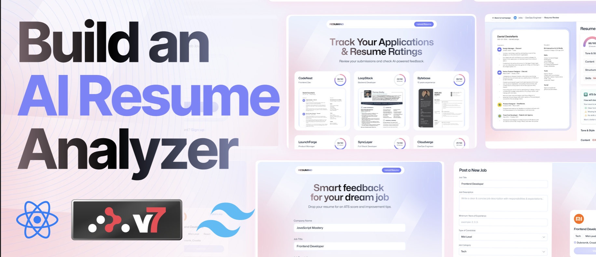

<div align="center">
<h1>AI Resume Analyzer</h1>
<h6><i>Manage your Job Application with Resume Analyzer</i></h6>
<hr />
</div>

Build an AI-powered Resume Analyzer with React, NextJs, Typescript, Tailwindcss and Puter.js! Implement seamless auth, upload and store resumes, and match candidates to jobs using smart AI evaluations. Get custom feedback and ATS scores tailored to each listing—all wrapped in a clean, reusable UI. Google, Facebook, and Healthgrades for comprehensive review management.

# 🏗️ Tech Stack

- **Framework**: [Next.js 14](https://nextjs.org/) with App Router
- **Styling**: [Tailwind CSS 4](https://tailwindcss.com/)
- **Authentication**: [NextAuth](https://next-auth.js.org/)
- **AI Models**: [Vercel AI SDK](https://ai-sdk.dev/) (openai models, gemini models)
- **Framer Motion**: [Framer Motion](https://motion.dev/docs)
- **React-Hook Form**: [Redux Hook Form](https://react-hook-form.com)
- **Zustand**: [Zustand](https://zustand.docs.pmnd.rs/getting-started/introduction)
- **Icons**: [Lucide React](https://lucide.dev/)


# 🎯 Prototype



# 🚀 How to Contribute

### 1. Clone the Repository

```bash
git clone https://github.com/olatunde1998/ai-resume-analyzer.git
cd ai-resume-analyzer
```

### 2. Install Dependencies

```bash
npm install
```

### 3. Environment Setup

Create a `.env` file in the project root:

```env
# Site Information (Optional)
NODE_ENV="development"
NEXT_PUBLIC_BASEURL="backendurl goes here"
NEXT_PUBLIC_APP_URL=https://app.theincite360.com

# Next-Auth Config
NEXTAUTH_SECRET=your_nextauth_secrete
NEXTAUTH_URL=http://localhost:3000
NEXTAUTH_DEBUG=true


# OpenAI API & Gemini API Key
OPENAI_API_KEY=tezza_openai_api_key
GEMINI_API_KEY=tezza_gemini_api_key

```

### 4. Start Development Server

```bash
npm run dev
```

Visit [http://localhost:3000](http://localhost:3000) to see your application running!

# Deployment

AWS Amplify was used to deploy the app.

- [AWS AMPLIFY](https://us-east-1.console.aws.amazon.com/amplify)

# License

The MIT License - Copyright (c) 2025 - Present, geodevcodes / Storage Service.

## 🆘 Support

- **Vercel AI-SDK**: [Vercel AI-SDK Documentation](https://ai-sdk.dev/docs/introduction/)
- **NextAuth**: [Appwrite Documentation](https://next-auth.js.org/)
- **Puter**: [Puter](https://docs.puter.com/)

## 🙏 Acknowledgments

- [Next.js](https://nextjs.org) for Frontend 
- [Vercel AI-SDK](https://ai-sdk.dev/) for AI model access
- [Tailwind CSS](https://tailwindcss.com)
- [Lucide](https://lucide.dev) for icons
- [NextAuth](https://next-auth.js.org/)

## Built by

- [Rasheed Olatunde](https://github.com/olatunde1998) (Senior Software Developer)
